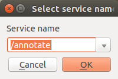
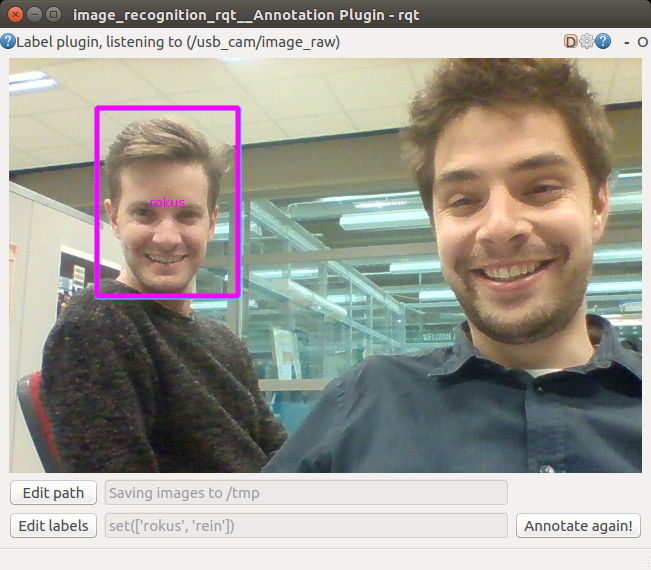
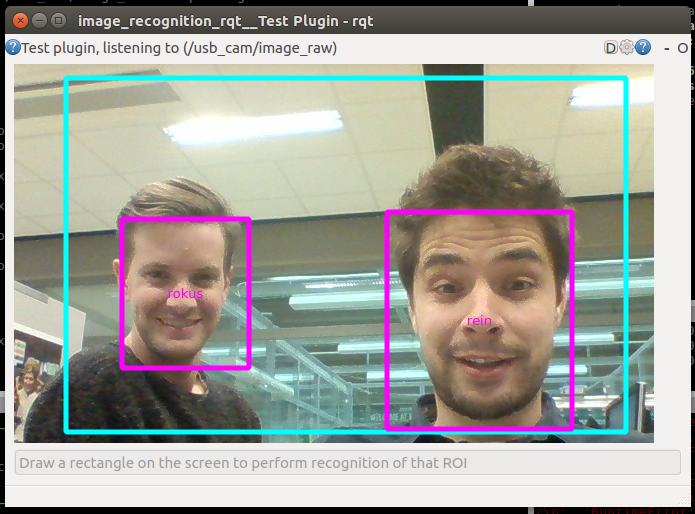

# image_recognition_openface

Face recognition with use of Openface (https://cmusatyalab.github.io/openface/)

## Installation

See https://github.com/tue-robotics/image_recognition

Make sure that openface is correctly installed. Installation instructions can be found here: https://cmusatyalab.github.io/openface/setup/. Make sure you have installed **CUDA8**. CUDA10 is not working: https://github.com/torch/torch7/issues/1180

```bash
export TORCH_INSTALL_PATH=~/torch
export OPENFACE_INSTALL_PATH=~/openface
git clone https://github.com/torch/distro.git ~/torch --recursive && \
cd $TORCH_INSTALL_PATH && bash install-deps && ./install.sh && \
for NAME in dpnn nn optim optnet csvigo cutorch cunn fblualib torchx tds; do $TORCH_INSTALL_PATH/install/bin/luarocks install $NAME; done && \
sudo -H pip install dlib && \
git clone https://github.com/cmusatyalab/openface.git $OPENFACE_INSTALL_PATH && \
cd $OPENFACE_INSTALL_PATH && sudo -H python setup.py install && \
./models/get-models.sh
```

## How-to

### ROS Node

Run the image_recognition_openface node in one terminal (Specify the dlib and openface_net path as ROS parameter):

    rosrun image_recognition_openface face_recognition_node

Run the rqt annotation client (https://github.com/tue-robotics/image_recognition_rqt)

    rosrun image_recognition_rqt annotation_gui

Setup the service by clicking the gear wheel in the top-right corner. Select the `/annotate` services exposed by the openface ros node. Also don't forget to set-up your labels.



Now draw a rectangle around the face you would like to learn. The face recognizer will find the biggest face in the image and store a representation for this face. 



Now select the label and you will see that the openface ros node stores the face (console output node):

    [INFO] [WallTime: 1478636380.407308] Succesfully learned face of 'rokus'

Learn as many faces as you want ..

Next step is starting the image_recognition_Rqt test gui (https://github.com/tue-robotics/image_recognition_rqt)

    rosrun image_recognition_rqt test_gui

Again configure the service you want to call with the gear-wheel in the top-right corner of the screen. If everything is set-up, draw a rectangle in the image and ask the service for detections:



You will see that the result of the detection will prompt in a dialog combo box. Also the detections will be drawn on the image.

### Command line

Command line interface to test the detection / recognition based on an image:

    usage: get_face_recognition [-h] -i IMAGE [-k ALIGN_PATH] [-s NET_PATH] [-v]

Run the command on an example image:

    rosrun image_recognition_openface get_face_recognition -i `rospack find image_recognition_openface`/doc/example.png

This will lookup this image in the image_recognition_openface/doc folder and perform recognitions


Output:

    [RecognizedFace(roi=(374, 188, 108, 123), l2_distances=[]), RecognizedFace(roi=(72, 147, 88, 105), l2_distances=[]), RecognizedFace(roi=(377, 95, 74, 86), l2_distances=[]), RecognizedFace(roi=(149, 26, 74, 86), l2_distances=[]), RecognizedFace(roi=(52, 47, 75, 86), l2_distances=[]), RecognizedFace(roi=(246, 115, 88, 102), l2_distances=[]), RecognizedFace(roi=(0, 0, 42, 60), l2_distances=[]), RecognizedFace(roi=(336, 33, 74, 86), l2_distances=[]), RecognizedFace(roi=(228, 0, 62, 60), l2_distances=[])]

Since no faces were trained, the l2_distances will not be calculated of-course.
