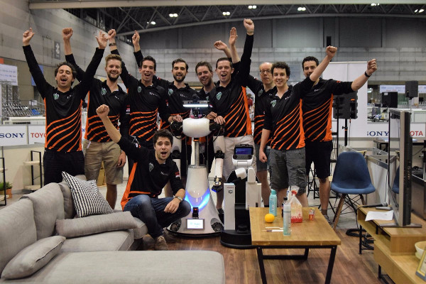
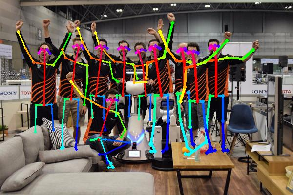
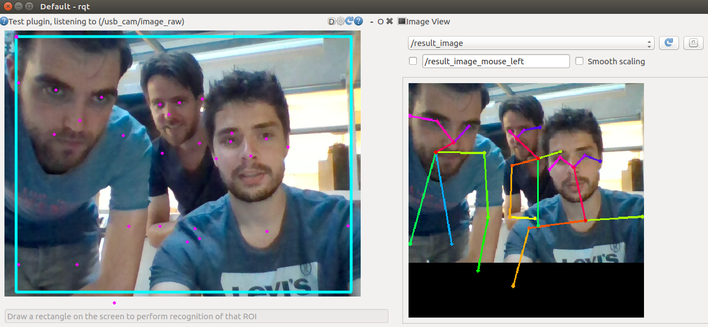

# Openpose image recognition

ROS Wrapper for openpose https://github.com/CMU-Perceptual-Computing-Lab/openpose

## Installation notes

This ROS wrapper makes use of the [Openpose python interface](https://github.com/CMU-Perceptual-Computing-Lab/openpose/blob/master/doc/modules/python_module.md).
Please follow the [installation manual](https://github.com/CMU-Perceptual-Computing-Lab/openpose/blob/master/doc/installation.md) and ensure that the `BUILD_PYTHON` flag is turned on while running CMake.

## Scripts

### detect_poses

Example for the following picture:



```bash
export MODEL_FOLDER=~/dev/openpose/models
rosrun image_recognition_openpose detect_poses $MODEL_FOLDER image `rospack find image_recognition_openpose`/doc/example.jpg
```

Output:



It also works with a webcam stream, usage:

```bash
usage: detect_poses [-h] [--pose_model POSE_MODEL]
                    [--net_input_size NET_INPUT_SIZE]
                    [--net_output_size NET_OUTPUT_SIZE]
                    [--num_scales NUM_SCALES] [--scale_gap SCALE_GAP]
                    [--num_gpu_start NUM_GPU_START]
                    [--overlay_alpha OVERLAY_ALPHA]
                    [--python_path PYTHON_PATH]
                    model_folder {image,cam} ...

Detect poses in an image

positional arguments:
  model_folder          Path where the models are stored
  {image,cam}           Mode
    image               Use image mode
    cam                 Use cam mode

optional arguments:
  -h, --help            show this help message and exit
  --pose_model POSE_MODEL
                        What pose model to use (default: BODY_25)
  --net_input_size NET_INPUT_SIZE
                        Net input size (default: -1x368)
  --net_output_size NET_OUTPUT_SIZE
                        Net output size (default: -1x-1)
  --num_scales NUM_SCALES
                        Num scales (default: 1)
  --scale_gap SCALE_GAP
                        Scale gap (default: 0.3)
  --num_gpu_start NUM_GPU_START
                        What GPU support (default: 0)
  --overlay_alpha OVERLAY_ALPHA
                        Overlay alpha for the output image (default: 0.6)
  --python_path PYTHON_PATH
                        Python path where Openpose is stored (default:
                        /usr/local/python/)
```

### openpose_node

## How-to

Run the image_recognition_openpose node in one terminal, e.g.:

```bash
export MODEL_FOLDER=~/dev/openpose/models
rosrun image_recognition_openpose openpose_node _model_folder:=$MODEL_FOLDER
```

Next step is starting the image_recognition_Rqt test gui (https://github.com/tue-robotics/image_recognition_rqt)

    rosrun image_recognition_rqt test_gui

Configure the service you want to call with the gear-wheel in the top-right corner of the screen. If everything is set-up, draw a rectangle in the image and ask the service for detections:



You will see that the result of the detection will prompt in a dialog combo box. Also the detections will be drawn on the image. The ROS node also published the result image, you can easily view this image using `rqt_image_view`.
